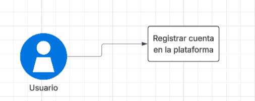
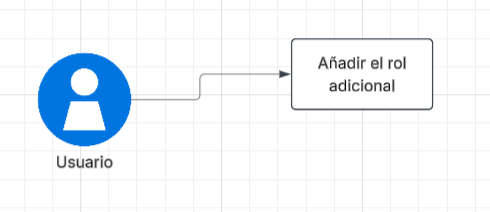
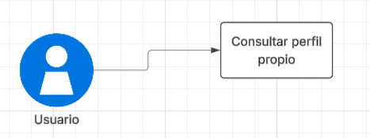
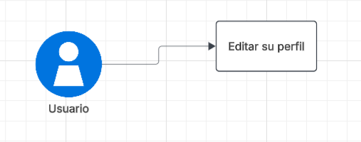
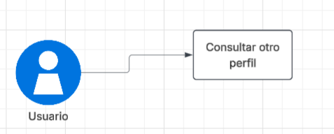
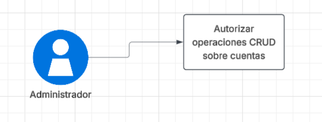
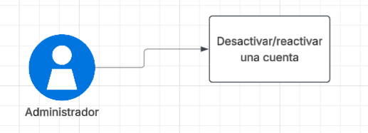

# 📄 Requerimientos del sistema en base al dominio de usuarios

## 1. Lista general de requerimientos

El sistema de OficioYa tiene los siguientes requerimientos (descripción a alto nivel):

### 1.1 Requerimientos funcionales

El sistema de OficioYa debe tener la capacidad de:

1. Permitir registrar una cuenta con los datos necesarios según el rol
2. Una misma cuenta debe tener roles simultáneos sin tener que crear otra cuenta
3. Consultar su propio perfil con la información registrada en la plataforma
4. Editar ciertas secciones principales del perfil (excepto las que están ocultas)
5. Consultar el perfil de otro usuario, mostrando información básica de acuerdo al tipo de rol
6. Autorizar al administrador de realizar todas las operaciones CRUD sobre las cuentas
de la plataforma
7. El administrador puede desactivar o reactivar una cuenta por si sucede algún conflicto o mal uso
de los servicios que ofrece la página web

### 1.2 Requerimientos no funcionales

El sistema de OficioYa debe tener:

1. Correo y teléfono de trabajadores y contratantes deben estar ocultos
para todos los usuarios (excepto para el administrador)
2. El administrador tiene acceso a la información completa (incluso las ocultas) de un usuario
3. Las acciones hechas por el administrador deben quedar registradas

## 2. Diagramas de caso de uso

### 2.1 Requerimiento Funcional 1

| Campo | Descripción                                                                                                                                                                              |
|------|------------------------------------------------------------------------------------------------------------------------------------------------------------------------------------------|
| **ID** | RF-01                                                                                                                                                                                    |
| **Nombre del requerimiento** | Permitir registrar una cuenta con los datos necesarios según el rol.                                                                                                                     |
| **Descripción** | *El sistema debe permitir a un usuario registrar su información y elegir el tipo de rol(es) a su cuenta*                                                                                 |
| **Precondiciones** | *El usuario no debe tener una cuenta previamente registrada con el mismo correo*                                                                                                         |
| **Actor** | *Usuario*                                                                                                                                                                                |
| **Flujo principal** | 1. El usuario entra a la plataforma 2. El usuario digita sus datos (si es trabajador o contratante) en los campos requeridos  3. La cuenta ha sido registrada dentro de OficioYa |
| **Diagrama de caso de uso** |                                                                                                                                       |
| **Poscondiciones** | *La cuenta del usuario debió haber sido registrada exitosamente dentro de la plataforma*                                                                                                 |

### 2.2 Requerimiento Funcional 2

| Campo | Descripción                                                                                                                                     |
|------|-------------------------------------------------------------------------------------------------------------------------------------------------|
| **ID** | RF-02                                                                                                                                           |
| **Nombre del requerimiento** | Una misma cuenta debe tener roles simultáneos sin tener que crear otra cuenta.                                                                  |
| **Descripción** | *Permitir dos roles a la vez en una misma cuenta*                                                                                               |
| **Precondiciones** | *El sistema debe permitir que una misma cuenta opere como trabajador y contratante a la vez, sin necesidad de crear una segunda cuenta*         |
| **Actor** | *Usuario*                                                                                                                                       |
| **Flujo principal** | 1. El usuario ingresa a su perfil  2. El usuario solicita añadir el rol faltante 3. El sistema habilita el nuevo rol en la misma cuenta |
| **Diagrama de caso de uso** |                                                                                                    |
| **Poscondiciones** | *La cuenta del usuario es habilitada con ambos roles*                                                                                           |

### 2.3 Requerimiento Funcional 3

| Campo | Descripción                                                                                                                             |
|------|-----------------------------------------------------------------------------------------------------------------------------------------|
| **ID** | RF-03                                                                                                                                   |
| **Nombre del requerimiento** | Consultar su propio perfil.                                                                                                             |
| **Descripción** | *El sistema debe permitir a un usuario consultar su propio perfil con la información registrada en la plataforma*                       |
| **Precondiciones** | *El usuario debe estar autenticado en la platorma*                                                                                      |
| **Actor** | *Trabajador o Contratante*                                                                                                              |
| **Flujo principal** | 1. El usuario ingresa a la sección *Perfil* 2. El sistema muestra información básica del usuario pero con correo y teléfono ocultos |
| **Diagrama de caso de uso** |                                                                                              |
| **Poscondiciones** | *El usuario debe ver correctamente su perfil*                                                                                           |

### 2.4 Requerimiento Funcional 4

| Campo | Descripción                                                                                                                                                           |
|------|-----------------------------------------------------------------------------------------------------------------------------------------------------------------------|
| **ID** | RF-04                                                                                                                                                                 |
| **Nombre del requerimiento** | Editar su propio perfil.                                                                                                                                              |
| **Descripción** | *El sistema debe permitir editar las secciones básicas del perfil con excepción de los campos ocultos*                                                                |
| **Precondiciones** | *El usuario debe estar autenticado y tener un perfil ya creado*                                                                                                       |
| **Actor** | *Trabajador o Contratante*                                                                                                                                            |
| **Flujo principal** | 1. El usuario ingresa a la sección *Editar perfil* 2. El usuario modifica los campos que puede editar (nombre, foto, oficio) 3. El sistema guarda los cambios |
| **Diagrama de caso de uso** |                                                                                                                             |
| **Poscondiciones** | *El perfil debe quedar actualizado con la nueva información*                                                                                                          |

### 2.5 Requerimiento Funcional 5

| Campo | Descripción                                                                                                                              |
|------|------------------------------------------------------------------------------------------------------------------------------------------|
| **ID** | RF-05                                                                                                                                    |
| **Nombre del requerimiento** | Consultar perfil de otro usuario.                                                                                                        |
| **Descripción** | *El sistema debe permitir consultar el perfil de otro usuario, mostrando información básica, según el rol sin mostrar correo y teléfono* |
| **Precondiciones** | *El usuario debe estar autenticado y tener un perfil ya creado*                                                                          |
| **Actor** | *Trabajador o Contratante*                                                                                                               |
| **Flujo principal** | 1. El usuario busca o selecciona otro usuario 2. El sistema muestra información básica de un perfil                                  |
| **Diagrama de caso de uso** |                                                                                        |
| **Poscondiciones** | *El usuario visualiza la información básica del perfil consultado*                                                                       |

### 2.6 Requerimiento Funcional 6

| Campo | Descripción                                                                                                                                                                                         |
|------|-----------------------------------------------------------------------------------------------------------------------------------------------------------------------------------------------------|
| **ID** | RF-06                                                                                                                                                                                               |
| **Nombre del requerimiento** | Autorizar al administrador a realizar operaciones CRUD sobre las cuentas.                                                                                                                           |
| **Descripción** | *El sistema debe permitir al administrador crear, consultar, actualizar y eliminar cuentas de usuarios en OficioYa*                                                                                 |
| **Precondiciones** | *El actor debe estar autenticado con rol de administrador*                                                                                                                                          |
| **Actor** | *Administrador*                                                                                                                                                                                     |
| **Flujo principal** | 1. El administrador ingresa al panel de gestionar usuarios 2. El administrador selecciona la operación que quiera hacer (CRUD) 3. El sistema ejecuta la operación en la cuenta seleccionada |
| **Diagrama de caso de uso** |                                                                                                                                                        |
| **Poscondiciones** | *La operación hecha se queda guardada en la cuenta gestionada*                                                                                                                                      |

### 2.7 Requerimiento Funcional 7

| Campo | Descripción                                                                                                                                                                                                                |
|------|----------------------------------------------------------------------------------------------------------------------------------------------------------------------------------------------------------------------------|
| **ID** | RF-07                                                                                                                                                                                                                      |
| **Nombre del requerimiento** | Desactivar o reactivar una cuenta.                                                                                                                                                                                         |
| **Descripción** | *El sistema debe permitir al administrador desactivar o reactivar una cuenta por si sucede un conflicto o mal uso de plataforma*                                                                                           |
| **Precondiciones** | *El actor debe estar autenticado con rol de administrador*                                                                                                                                                                 |
| **Actor** | *Administrador*                                                                                                                                                                                                            |
| **Flujo principal** | 1. El administrador selecciona la cuenta reportada por algún usuario de la plataforma 2. El administrador cambia el estado de la cuenta (activa/inactiva) 3. El sistema actualiza el estado en que queda la cuenta |
| **Diagrama de caso de uso** |                                                                                                                                                                  |
| **Poscondiciones** | *La cuenta queda desactivada o reactivada según la acción hecha*                                                                                                                                                           |