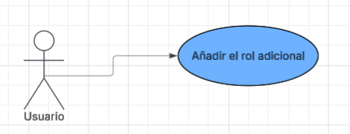
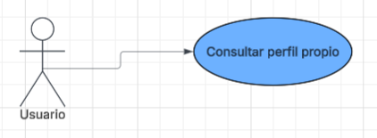
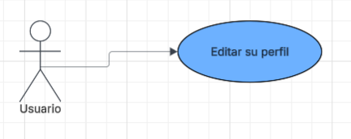
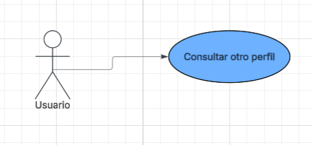
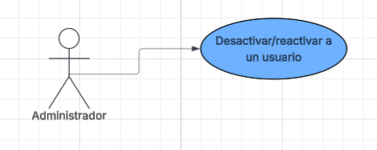
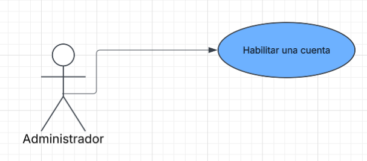
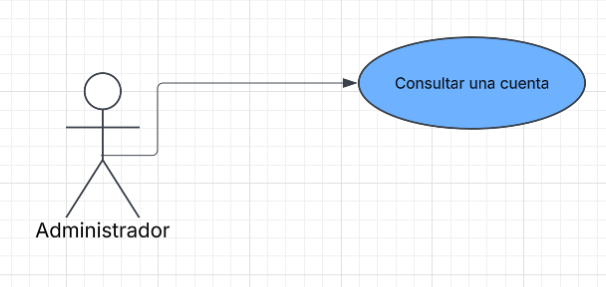

# 📄 Requerimientos del sistema en base al dominio de usuarios

## 1. Lista general de requerimientos

El sistema de OficioYa tiene los siguientes requerimientos (descripción a alto nivel):

### 1.1 Requerimientos funcionales

El sistema de OficioYa debe tener la capacidad de:

1. Permitir registrar un usuario con los datos necesarios según el rol
2. Un mismo usuario debe tener roles simultáneos sin tener que crear otro usuario
3. Consultar su propio perfil con la información registrada en la plataforma
4. Editar ciertas secciones principales del perfil (excepto las que están ocultas)
5. Consultar el perfil de otro usuario, mostrando información básica de acuerdo al tipo de rol
6. El administrador puede desactivar o reactivar una cuenta por si sucede algún conflicto o mal uso de los servicios que ofrece la página web

### 1.2 Requerimientos no funcionales

El sistema de OficioYa debe tener:

1. Correo y teléfono de trabajadores y contratantes deben estar ocultos para todos los usuarios (excepto para el administrador)
2. El administrador tiene acceso a la información completa (incluso las ocultas) de un usuario
3. Las acciones hechas por el administrador deben quedar registradas
4. Cobertura de pruebas unitarios de mínimo del 80%
5. El sistema debe registrar logs de cada generación y exportación de reporte

## 2. Diagramas de caso de uso

### 2.1 Requerimiento Funcional 1

| Campo                        | Descripción                                                                                                                                                                                                                               |
|------------------------------|-------------------------------------------------------------------------------------------------------------------------------------------------------------------------------------------------------------------------------------------|
| **ID**                       | RF-01                                                                                                                                                                                                                                     |
| **Nombre del requerimiento** | Permitir registrar una cuenta con los datos necesarios según el rol.                                                                                                                                                                      |
| **Descripción**              | *El sistema debe permitir a un usuario registrar su información y elegir el tipo de rol(es) a su cuenta*. El formulario del usuario debe quedar de la siguiente manera: [Requisito de datos del usuario](./data_user_requirements.md) |
| **Precondiciones**           | *El usuario no debe tener una cuenta previamente registrada con el mismo correo*                                                                                                                                                          |
| **Actor**                    | *Usuario*                                                                                                                                                                                                                                 |
| **Flujo principal**          | 1. El visitante ingresa al formulario de registro 2. El visitante elige el rol: trabajador o contratante 3. El visitante diligencia los datos obligatorios del rol y los opcionales que desee 4. El visitante envía el formulario 5. El sistema valida formato y unicidad del correo 6. El sistema crea la cuenta en estado Activa con el rol elegido 7. El sistema envía la contraseña al Identity domain para crear las credenciales  8. El sistema informa que el registro fue exitoso |
| **Poscondiciones**           | *Existe una cuenta en estado Activa con el rol elegido y con los datos ingresados. El correo queda asociado únicamente a esa cuenta*                                                                                                      |

### 2.2 Requerimiento Funcional 2

| Campo                        | Descripción                                                                                                                                     |
|------------------------------|-------------------------------------------------------------------------------------------------------------------------------------------------|
| **ID**                       | RF-02                                                                                                                                           |
| **Nombre del requerimiento** | Agregar un segundo rol a una cuenta.                                                                                                            |
| **Descripción**              | *El sistema debe permitir que una cuenta con un solo rol (trabajador o contratante) agregue el rol faltante sin crear otra cuenta. Los datos que ya tiene la cuenta (nombre, correo, teléfono, foto) se reutilizan* |
| **Precondiciones**           | *El usuario está autenticado y su cuenta está Activa y tiene exactamente un rol*                                                                |
| **Actor**                    | *Usuario*                                                                                                                                       |
| **Flujo principal**          | 1. El usuario ingresa a su perfil 2. El usuario solicita agregar el rol faltante 3. El sistema muestra únicamente los datos obligatorios del nuevo rol que la cuenta aún no tiene 4. El usuario diligencia esos datos y los envía 5. El sistema valida los datos 6. El sistema habilita el nuevo rol en la misma cuenta |
| **Diagrama de caso de uso**  |                                                                                                    |
| **Poscondiciones**           | *La cuenta tiene los roles de trabajador y de contratante. No se creó otra cuenta ni otro correo*                                              |

### 2.3 Requerimiento Funcional 3

| Campo                        | Descripción                                                                                                                             |
|------------------------------|-----------------------------------------------------------------------------------------------------------------------------------------|
| **ID**                       | RF-03                                                                                                                                   |
| **Nombre del requerimiento** | Consultar el perfil propio.                                                                                                             |
| **Descripción**              | *El sistema debe permitir a un usuario consultar su propio perfil con la información registrada en la plataforma*                       |
| **Precondiciones**           | *El usuario está autenticado y su cuenta está Activa*                                                                                   |
| **Actor**                    | *Trabajador o Contratante*                                                                                                              |
| **Flujo principal**          | 1. El usuario ingresa a la sección Perfil 2. El sistema muestra los datos del perfil de cada uno de sus roles pero con correo y teléfono ocultos de manera parcial (ej: *****@gmail.com) |
| **Diagrama de caso de uso**  |                                                                                              |
| **Poscondiciones**           | *El usuario ve todos los datos de su perfil. No se muestran datos de otros usuarios*                                                    |

### 2.4 Requerimiento Funcional 4

| Campo                        | Descripción                                                                                                                                                           |
|------------------------------|-----------------------------------------------------------------------------------------------------------------------------------------------------------------------|
| **ID**                       | RF-04                                                                                                                                                                 |
| **Nombre del requerimiento** | Editar el perfil propio.                                                                                                                                              |
| **Descripción**              | *El sistema debe permitir que un usuario modifique los campos editables de su perfil*                                                                                 |
| **Precondiciones**           | *El usuario está autenticado y su cuenta está Activa*                                                                                                                 |
| **Actor**                    | *Trabajador o Contratante*                                                                                                                                            |
| **Flujo principal**          | 1. El usuario ingresa a la sección Editar perfil 2. El sistema muestra los campos editables con su valor actual 3. El usuario modifica uno o más campos y confirma 4. El sistema valida los datos con las mismas reglas del registro 5. El sistema guarda los cambios |
| **Diagrama de caso de uso**  |                                                                                                                             |
| **Poscondiciones**           | *El perfil muestra los valores nuevos. Los campos no editables conservan su valor*                                                                                   |

### 2.5 Requerimiento Funcional 5

| Campo                        | Descripción                                                                                                                              |
|------------------------------|------------------------------------------------------------------------------------------------------------------------------------------|
| **ID**                       | RF-05                                                                                                                                    |
| **Nombre del requerimiento** | Consultar el perfil público de otro usuario.                                                                                             |
| **Descripción**              | *El sistema debe permitir consultar el perfil de otro usuario, mostrando información básica, según el rol sin mostrar correo y teléfono* |
| **Precondiciones**           | *El usuario está autenticado y su cuenta está Activa. La cuenta consultada existe y está Activa*                                         |
| **Actor**                    | *Trabajador o Contratante*                                                                                                               |
| **Flujo principal**          | 1. El usuario selecciona un perfil desde un resultado de búsqueda o un enlace 2. El sistema obtiene los datos públicos del usuario seleccionado 3. El sistema muestra el perfil público según el rol de esa cuenta |
| **Diagrama de caso de uso**  |                                                                                        |
| **Poscondiciones**           | *El usuario ve únicamente los campos públicos del perfil consultado*                                                                     |

### 2.6 Requerimiento Funcional 6

| Campo                        | Descripción                                                                                                                                                                                                                |
|------------------------------|----------------------------------------------------------------------------------------------------------------------------------------------------------------------------------------------------------------------------|
| **ID**                       | RF-06                                                                                                                                                                                                                      |
| **Nombre del requerimiento** | Desactivar una cuenta.                                                                                                                                                                                                     |
| **Descripción**              | *El sistema debe permitir que el administrador desactive una cuenta por conflicto o mal uso de la plataforma.*                                                                                                             |
| **Precondiciones**           | *El administrador está autenticado. La cuenta seleccionada existe y está Activa*                                                                                                                                           |
| **Actor**                    | *Administrador*                                                                                                                                                                                                            |
| **Flujo principal**          | 1. El administrador selecciona la cuenta 2. El administrador solicita desactivarla 3. El administrador ingresa el motivo (obligatorio) 4. El sistema cambia el estado de la cuenta a Inactiva 5. El sistema registra la acción (RNF-02) |
| **Diagrama de caso de uso**  |                                                                                                                                                                     |
| **Poscondiciones**           | La cuenta está en estado Inactiva y existe un registro de la acción con su motivo                                                                                                                                          |

### 2.7 Requerimiento Funcional 7

| Campo | Descripción |
|-------|-------------|
| **ID** | RF-07 |
| **Nombre del requerimiento** | Reactivar una cuenta |
| **Descripción** | El sistema debe permitir que el administrador reactive una cuenta Inactiva |
| **Precondiciones** | El administrador está autenticado. La cuenta seleccionada existe y está Inactiva |
| **Actor** | Administrador |
| **Flujo principal** | 1. El administrador selecciona la cuenta 2. El administrador solicita reactivarla 3. El administrador ingresa el motivo (obligatorio) 4. El sistema cambia el estado de la cuenta a Activa 5. El sistema registra la acción (RNF-02) |
| **Diagrama de caso de uso** |  |
| **Poscondiciones** | La cuenta está en estado Activa, puede iniciar sesión y su perfil vuelve a ser consultable. Existe un registro de la acción con su motivo |

### 2.8 Requerimiento Funcional 8

| Campo | Descripción |
|-------|-------------|
| **ID** | RF-08 |
| **Nombre del requerimiento** | Consultar el perfil completo de una cuenta |
| **Descripción** | El sistema debe permitir que el administrador consulte todos los datos de una cuenta, incluidos correo, teléfono, roles y estado, para atender reportes y disputas |
| **Precondiciones** | El administrador está autenticado. La cuenta seleccionada existe (Activa o Inactiva) |
| **Actor** | Administrador |
| **Flujo principal** | 1. El administrador selecciona la cuenta 2. El sistema muestra todos los datos de la cuenta  |
| **Diagrama de caso de uso** |  |
| **Poscondiciones** | El administrador ve todos los datos de la cuenta, incluidos los ocultos |